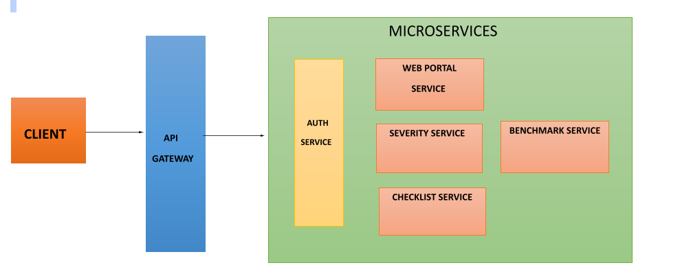
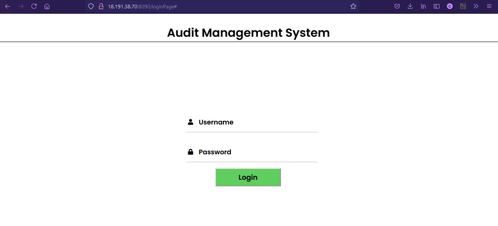
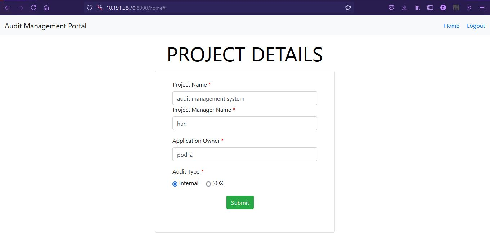
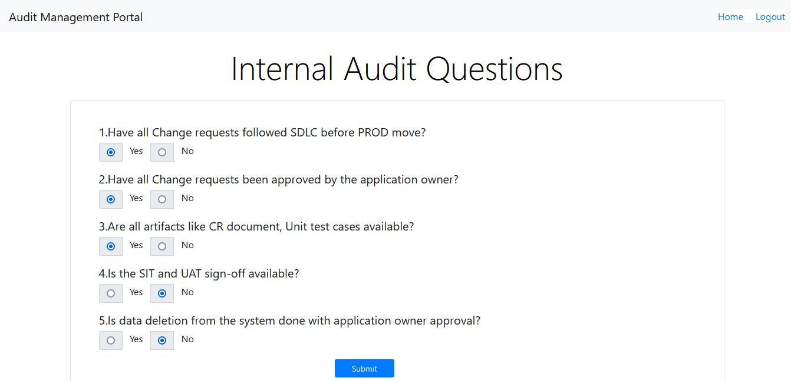
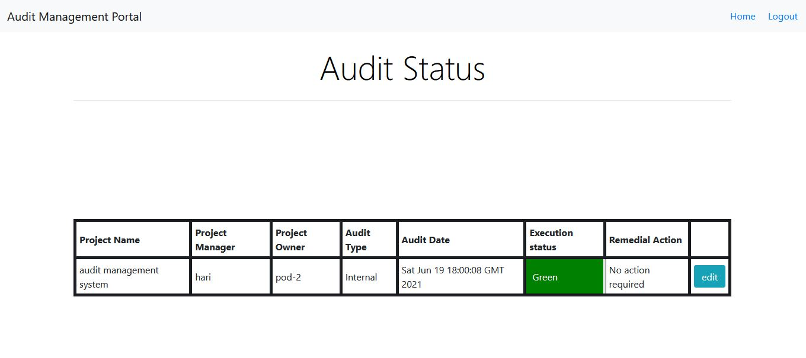
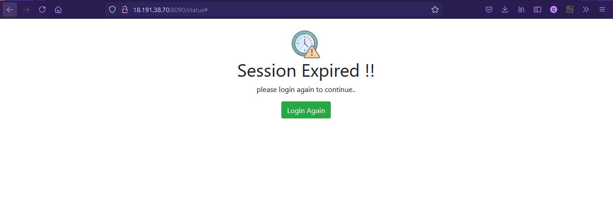

# Audit-Portal-Management-System

Audit Management system is an application which defines the on-site verification activity, such as inspection or examination, of a process or quality system, to ensure compliance to requirements.
  
Audit management system for examining the remedial action to be taken based on the response related to the requirements given. 
We are using 3-tier architecture i.e. separate layer for presentation, application and database which is implemented by web portal, API Microservices and Audit DB database.
 
### [MICROSERVICES:](https://microservices.io/)

It is an architectural style that structures an application as a collection of services. Highly maintainable and testable. Loosely coupled. Independently deployable.

####_Here is the microservice diagram of our project : _

### * Audit Web Portal Service :

 A web portal is a web-based platform that provides users with a single access point to information. Each information regarding microservices gets dedicated area on the page.
 
### * Audit Authorization Service :

Authentication service is used for the information security. Here, we have used JWT for security. It is a compact and self-contained way for securely transmitting information between parties as a JSON object.

### * Audit checklist service :

Audit checklist service is used to get list of questions. Once the user successfully logged in, it goes to home page where the user have to enter project details and audit type.

### * Audit benchmark service :

Audit benchmark service used here, is to set the threshold value for internal and sox audit type. The threshold value for internal is 3 and for sox is 1.

### * Audit severity service :

Audit severity service is used to calculate the status of execution. This service calls other two services namely audit checklist and audit benchmark to get the list of questions and pre-defined threshold values for audit type which is connected through feign clients, a declarative web service (HTTP client) to call the REST services.

### _Here are some screenshots of the project _

* Login Page :

* Home Page :

* Audit Type - Internal Questions :

* Audit Type - Internal Questions - Results :

* Session Expired Page :

_Thank you for reading this far , Happy Learning !_

 
 

